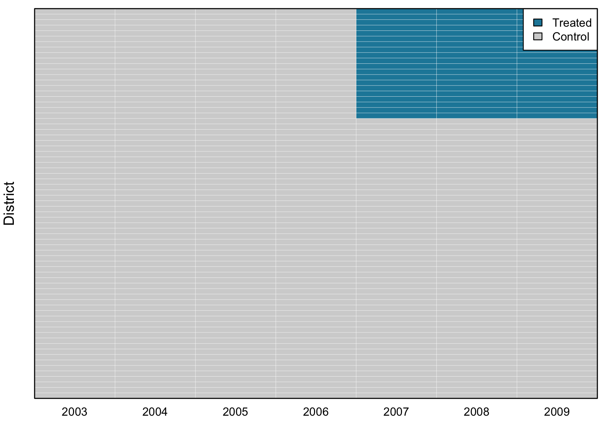
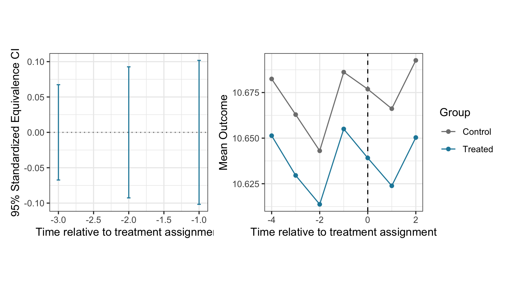
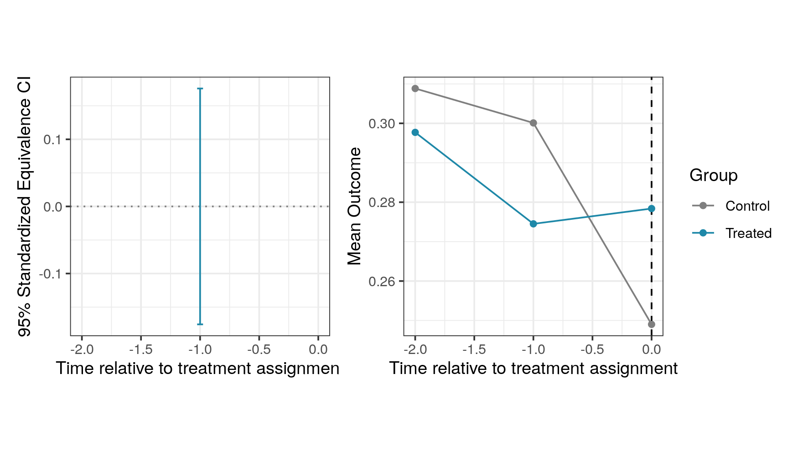
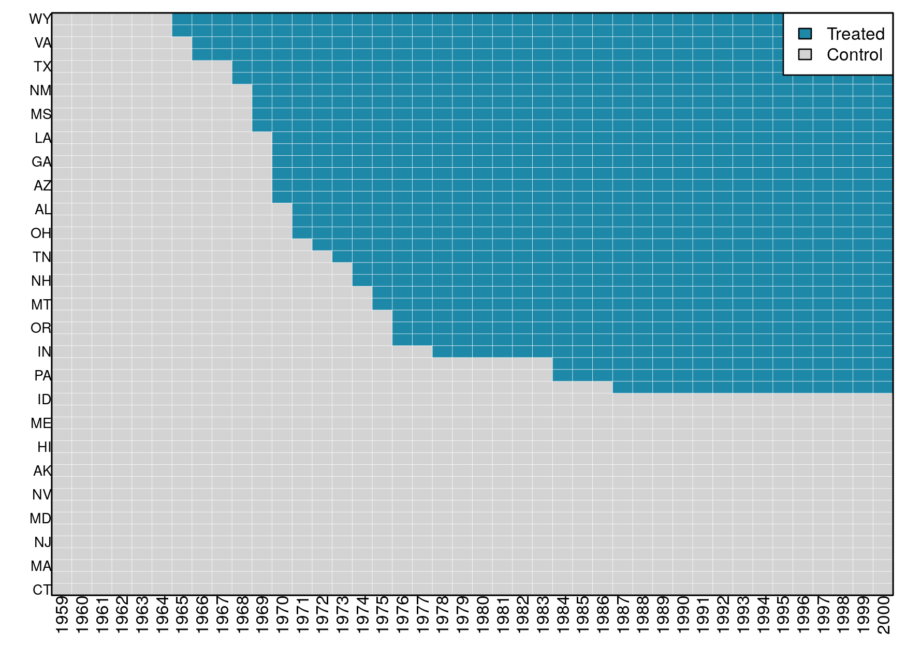
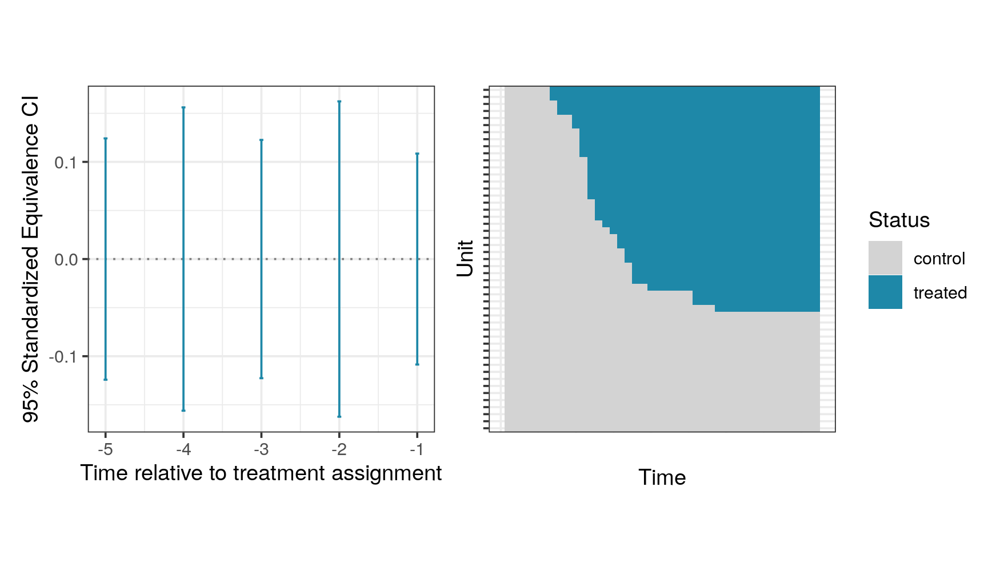

# DIDdesign: Double Difference-in-Differences

<!-- badges: start -->

[](https://github.com/naoki-egami/DIDdesign/actions)
<!-- badges: end -->

Authors:

  - [Naoki Egami](https://naokiegami.com/)
  - [Soichiro Yamauchi](https://soichiroy.github.io/)

Reference:

  - Egami and Yamauchi (2019) “Using Multiple Pre-treatment Periods to
    Improve Difference-in-Differences and Staggered Adoption Designs.”

## Installation Instructions:

  - Downloading the most recent version of `DIDdesign` from Github
    
    ``` r
    ## need to install `devtools` if necessary
    require(devtools)
    install_github("naoki-egami/DIDdesign", dependencies = TRUE)
    ```

## Table of Contents

1.  [Basic DID design with panel
    data](#The-Basic-Difference-in-Differences-Design-with-Panel-Data)
2.  [Basic DID design with repeated cross-section
    data](#The-Standard-DID-Design-with-Repeated-Cross-sectional-Data)
3.  [Staggered adoption design](#Staggered-Adoption-Design)

## The Basic Difference-in-Differences Design with Panel Data

``` r
## load package
require(DIDdesign)
require(tidyverse)


## load data
data(anzia2012)
```

In the basic DID design, units receive the treatment at the same time.
In `anzia2012` dataset, the treatment assignment happens in 2007.



### Step 1: Assess the parallel trends assumption

As the first step of the double DID method, users can check if the
parallel trends assumption is plausible in the pre-treatment periods.
`did_check()` function estimates statistics for testing the parallel
trends and computes the equivalence confidence intervals.

``` r
## check parallel trends
set.seed(1234)
check_panel <- did_check(
  formula = lnavgsalary_cpi ~ oncycle | teachers_avg_yrs_exper +
                       ami_pc + asian_pc + black_pc + hisp_pc,
  data    = anzia2012,
  id_unit = "district",
  id_time = "year",
  option  = list(n_boot = 200, parallel = TRUE, lag = 1:3)
)
```

`did_check()` function takes the following arguments:

| Argument                                                                                                                                                                                                                                                                                  | Description                                                                                       |
| :---------------------------------------------------------------------------------------------------------------------------------------------------------------------------------------------------------------------------------------------------------------------------------------- | :------------------------------------------------------------------------------------------------ |
| `formula`                                                                                                                                                                                                                                                                                 | A formula specifying variables. It should follow the form of `outcome ~ treatment \| covariates`. |
| <br />`treatment` should be time-varying, that is, `treatment` takes zero for everyone before the treatment assignment, and takes 1 for units who are treated. See the example for how the treatment variable should be coded.<br />`covariates` can be omitted as `outcome ~ treatment`. |                                                                                                   |

  - `data`: A data frame. This can be either `data.frame` or `tibble`.
  - `id_unit`: A variable name in the data that uniquely identifies
    units (e.g., individuals or states).
  - `id_time`: A variable name in the data that uniquely identifies time
    (e.g., year).
  - `design`: Design option. It should be `"did"` when the standard DID
    design is used.
  - `is_panel`: A boolean argument to indicate the type of the data.
    When the dataset is panel (i.e., same observations are measured
    repeately overtime), it should take `TRUE`. See the next section for
    how to analyze the repeated cross-section data.
  - `option`: A list of options.
      - `n_boot`: Number of bootstrap iterations to estimate weighting
        matrix.
      - `parallel`: A boolean argument. If `TRUE`, bootstrap is
        conducted in parallel using `future` package.
      - `lag`: A vector of non-negative lead parameter. For example,
        when `lead = c(0, 1)`, treatment effect when the treatment is
        assigned (`lead = 0`) as well as one-time ahead effect (`lead
        = 1`) will be estimated. Default is `lead = 0`.

<!-- end list -->

``` r
## view estimates
summary(check_panel)
#> ── Standardized Estimates ──────────────────────────────────────────────────────
#>   estimate lag std.error EqCI95_LB EqCI95_UB
#> 1 -0.04632   1    0.0337   -0.1018    0.1018
#> 2  0.04285   2    0.0303   -0.0926    0.0926
#> 3 -0.00597   3    0.0373   -0.0674    0.0674
```

``` r
## visualize the estimates
plot(check_panel)
```



  - Data used to generate the above plot are available via
    
    ``` r
    ## data for the trend-plot
    check_panel$plot[[1]]$dat_plot
    
    ## data for the equivalence plot
    check_panel$plot[[2]]$dat_plot
    ```

  - Individual plots are also available via
    
    ``` r
    ## trend plot
    check_panel$plot[[1]]$plot
    
    ## equivalence plot
    check_panel$plot[[2]]$plot
    ```

### Step 2: Estimate the treatment effect with the double DID estimator

``` r
## estimate treatment effect
set.seed(1234)
fit_panel <- did(
  formula  = lnavgsalary_cpi ~ oncycle | teachers_avg_yrs_exper +
                                          ami_pc + asian_pc + black_pc + hisp_pc,
  data     = anzia2012,
  id_unit  = "district",
  id_time  = "year",
  design   = "did",
  is_panel = TRUE,
  option   = list(n_boot = 200, parallel = TRUE, lead = 0:2)
)
```

`did()` function inherits most of the arguments in `did_check()`.

  - `option`:
      - `lead`: A vector of non-negative lead parameter. For example,
        when `lead = c(0, 1)`, treatment effect when the treatment is
        assigned (`lead = 0`) as well as one-time ahead effect (`lead
        = 1`) will be estimated. Default is `lead = 0`.

<!-- end list -->

``` r
## view the estimates
summary(fit_panel)
#> ── ATT Estimates ───────────────────────────────────────────────────────────────
#>    estimator lead estimate std.error statistic p_value
#> 1 Double-DID    0  -0.0041    0.0026      -1.6  0.1149
#> 2        DID    0  -0.0062    0.0027      -2.3  0.0194
#> 3       sDID    0  -0.0044    0.0044      -1.0  0.3179
#> 4 Double-DID    1  -0.0067    0.0032      -2.1  0.0370
#> 5        DID    1  -0.0115    0.0036      -3.2  0.0016
#> 6       sDID    1  -0.0031    0.0039      -0.8  0.4260
#> 7 Double-DID    2  -0.0051    0.0043      -1.2  0.2376
#> 8        DID    2  -0.0115    0.0049      -2.3  0.0196
#> 9       sDID    2   0.0015    0.0049       0.3  0.7664
```

`summary()` function can be used to view estimates.

``` r
# plot only treatment effects
post_plot <- plot(fit_panel)

# plot treatment effects + pre-treatment assessment
pre_post_plot <- plot(fit_panel, check_fit = check_panel)

## show the plots side-by-side
require(patchwork)
(post_plot +
  ggplot2::theme(aspect.ratio=1) +
  ggplot2::ylim(-0.015, 0.01) +
  ggplot2::labs(title = "Post-Treatment")) +
(pre_post_plot +
  ggplot2::theme(aspect.ratio=1) +
  ggplot2::ylim(-0.015, 0.01) +
  ggplot2::labs(title = "Pre- and Post-Treatment"))
```


## The Standard DID Design with Repeated Cross-sectional Data

Sometimes, each period consists of different units, instead of repeated
observations of the same units. `did()` can handle such “repeated
cross-sectional” data by setting `is_panel = FALSE`. As an example, we
analyze `malesky2014` dataset (see `?malesky2014` for more details on
this dataset).

### Step 1: Assess the pre-treatment parallel trends

``` r
## load data
data(malesky2014)

## check parallel trends
set.seed(1234)
check_rcs <- did_check(
  formula = transport ~ treatment + post_treat | factor(city),
  data    = malesky2014,
  id_time = "year",
  is_panel= FALSE,
  option  = list(n_boot = 200, parallel = TRUE, id_cluster = "tinh", lag = 1)
)
```

``` r
## summary
summary(check_rcs)
#> ── Standardized Estimates ──────────────────────────────────────────────────────
#>   estimate lag std.error EqCI95_LB EqCI95_UB
#> 1    -0.15   1      0.12    -0.347     0.347
```

``` r
plot(check_rcs)
```



### Step 2: Estimate causal effects

``` r
## estimate ATT
ff_rcs <- did(
  formula = transport ~ treatment + post_treat | factor(city),
  data    = malesky2014,
  id_time = 'year',
  is_panel= FALSE,
  option  = list(n_boot = 200, parallel = TRUE, id_cluster = "tinh", lead = 0)
)
```

  - `formula` now includes `treatment` variable as well as the
    post-treatment time indicator.
  - `id_cluster`: A variable used to cluster the standard errors.

<!-- end list -->

``` r
summary(ff_rcs)
#> # A tibble: 3 x 6
#>   estimator   lead estimate std.error statistic p_value
#>   <chr>      <dbl>    <dbl>     <dbl>     <dbl>   <dbl>
#> 1 Double-DID     0    0.239    0.0909     2.63  0.00842
#> 2 DID            0    0.101    0.105      0.957 0.338  
#> 3 sDID           0    0.169    0.138      1.22  0.221
```

## Staggered Adoption Design

`DIDdesign` supports the staggered adoption design where units receive
the treatment at different periods of time. As an example, we analyze
`paglayan2019` dataset in the package (see `?paglayan2019` for more
details about this dataset).

``` r
## data
require(dplyr)
require(tibble)

## format dataset
paglayan2019 <- paglayan2019 %>%
  filter(!(state %in% c("WI", "DC"))) %>%
  mutate(id_time = year,
         id_subject = as.numeric(as.factor(state)),
         log_expenditure = log(pupil_expenditure + 1),
         log_salary      = log(teacher_salary + 1))
```



As we can see in the above plot, states receive the treatment at
different years ranging from 1965 at earliest to 1987 at latest (and
some of the states never receive the treatment).

### Step 1: Assess the pre-treatment parallel trends

``` r
set.seed(1234)
check_sa <- did_check(
  formula = log_expenditure ~ treatment,
  data    = paglayan2019,
  id_unit = "id_subject",
  id_time = "id_time",
  design  = "sa",
  option  = list(n_boot = 200, parallel = TRUE, thres = 1, lag = 1:5)
)

## view estimates
summary(check_sa)
#> ── Standardized Estimates ──────────────────────────────────────────────────────
#>   estimate lag std.error EqCI95_LB EqCI95_UB
#> 1  -0.0197   1    0.0540    -0.109     0.109
#> 2  -0.0691   2    0.0566    -0.162     0.162
#> 3   0.0163   3    0.0647    -0.123     0.123
#> 4  -0.0447   4    0.0677    -0.156     0.156
#> 5  -0.0488   5    0.0458    -0.124     0.124
```

In addition to options described in the previous section, there is one
additional argument specific to the staggered adoption design.

  - `thres` parameter in the option control the minimum number of
    treated units for a particular time to be included in the treatment
    effect estimation. For example if `thres = 2`, the effect for
    Tennessee will be removed from the time-average effect because it’s
    the only unit who received the treatment in 1972 (i.e., the number
    of treated units in 1972 is less than the threshold).

<!-- end list -->

``` r
plot(check_sa)
```



### Step 2: Estimate staggered-adoption average treatment effect

`did()` function can handle the staggered adoption design by setting the
`design` argument to `design = "sa"`.

``` r
## estimate time-weighted SA-ATE
set.seed(1234)
fit_sa <- did(
  formula = log_expenditure ~ treatment,
  data    = paglayan2019,
  id_unit = "id_subject",
  id_time = "id_time",
  design  = "sa",
  option  = list(n_boot = 200, lead = 0:9, thres = 2, parallel = TRUE)
)
```

``` r
head(summary(fit_sa))
#> # A tibble: 6 x 6
#>   estimator      lead  estimate std.error statistic p_value
#>   <chr>         <int>     <dbl>     <dbl>     <dbl>   <dbl>
#> 1 SA-Double-DID     0  0.00869     0.0206    0.422    0.673
#> 2 SA-DID            0  0.0149      0.0162    0.921    0.357
#> 3 SA-sDID           0  0.00903     0.0195    0.463    0.643
#> 4 SA-Double-DID     1 -0.0152      0.0163   -0.936    0.349
#> 5 SA-DID            1  0.000916    0.0151    0.0606   0.952
#> 6 SA-sDID           1 -0.0199      0.0206   -0.970    0.332
```

``` r
## plot treatment effects + assessment statistic
sa_plot <- plot(fit_sa, check_sa, band = TRUE)

## show plot
sa_plot +
  ggplot2::ylim(-0.1, 0.1) +
  ggplot2::geom_vline(xintercept = 0, color = 'red', linetype = 'dotted')
```


