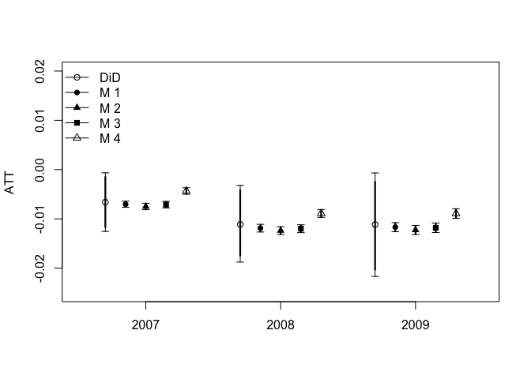

DIDdesign: Double Difference-in-Differences
===========================================

Authors:

-   [Naoki Egami](https://scholar.princeton.edu/negami/home)
-   Soichiro Yamauchi

Reference

Installation
------------

-   Downloading `DIDdesign` from Github

    ``` r
    ## need to install `devtools` if necessary
    require(devtools)
    install_github("naoki-egami/DIDdesign", dependencies = TRUE)
    ```

Example
-------

### Load Sample Data

``` r
# load package 
require(DIDdesign)
```

    ## Loading required package: DIDdesign

``` r
# load sample data 
data("anzia2012")
```

### Visualizing Data

### Nonparametric Estimator

``` r
# estimate ATT 
fit_np <- did(lnavgsalary_cpi ~ oncycle, data = anzia2012,
    id_subject = "district", id_time = "year",
    post_treatment = c(2007, 2008, 2009),
    method = "nonparametric",
    se_boot = TRUE, n_boot  = 100, boot_min = FALSE,
    select = "HQIC")
```

    ## 
    ## ... estimating treatment effect for  2007  ...
    ## ... bootstraping to compute standard errors ...
    ## ... computing the standard DiD estimate ...
    ## 
    ## ... estimating treatment effect for  2008  ...
    ## ... bootstraping to compute standard errors ...
    ## ... computing the standard DiD estimate ...
    ## 
    ## ... estimating treatment effect for  2009  ...
    ## ... bootstraping to compute standard errors ...
    ## ... computing the standard DiD estimate ...

``` r
# summary function 
summary(fit_np)
```

    ##                                2007             2008             2009
    ## 1   D-DiD      ATT           -0.007           -0.012           -0.012
    ## 2           95% CI [-0.013, -0.002]  [-0.02, -0.004] [-0.023, -0.001]
    ## 3              BIC          -18.018          -18.018          -18.018
    ## 4             HQIC           -9.147           -9.147           -9.147
    ## 5         Selected               M1               M1               M1
    ## 6 Std-DiD      ATT           -0.007           -0.011           -0.011
    ## 7           95% CI [-0.011, -0.002] [-0.019, -0.004]  [-0.02, -0.001]

``` r
# plot results 
plot(fit_np, full = TRUE)
```


### Parametric Estimator (with Covariates)

``` r
fit_p1 <- did(lnavgsalary_cpi ~ oncycle | teachers_avg_yrs_exper + 
                        ami_pc + asian_pc + black_pc + hisp_pc,
  data = anzia2012, id_subject = 'district', id_time = 'year', 
  post_treatment = c(2007, 2008, 2009), 
    method = 'parametric')
```

    ## 
    ## ... estimating treatment effect for  2007  ...
    ## 
    ## ... estimating treatment effect for  2008  ...
    ## 
    ## ... estimating treatment effect for  2009  ...

``` r
# summary function 
summary(fit_p1)
```

    ##                                2007             2008             2009
    ## 1   D-DiD      ATT           -0.008           -0.015           -0.015
    ## 2           95% CI [-0.009, -0.008] [-0.016, -0.014] [-0.016, -0.014]
    ## 3         Selected               M1               M1               M1
    ## 4 2way-FE      ATT           -0.008           -0.015           -0.015
    ## 5           95% CI [-0.013, -0.003] [-0.022, -0.008] [-0.024, -0.006]

``` r
# plot function 
plot(fit_p1, full = TRUE, ylim = c(-0.025, 0.02))
```



We can compare estimates from a model without covariates.

``` r
fit_p2 <- did(lnavgsalary_cpi ~ oncycle, data = anzia2012,
    id_subject = "district", id_time = "year",
    post_treatment = c(2007, 2008, 2009),
    method = "parametric")
```

    ## 
    ## ... estimating treatment effect for  2007  ...
    ## 
    ## ... estimating treatment effect for  2008  ...
    ## 
    ## ... estimating treatment effect for  2009  ...

``` r
# summary function 
summary(fit_p2)
```

    ##                                2007             2008             2009
    ## 1   D-DiD      ATT           -0.007           -0.012           -0.012
    ## 2           95% CI [-0.008, -0.006] [-0.013, -0.011] [-0.013, -0.011]
    ## 3         Selected               M1               M1               M1
    ## 4 2way-FE      ATT           -0.006           -0.011           -0.011
    ## 5           95% CI  [-0.014, 0.001]  [-0.02, -0.002]      [-0.022, 0]

``` r
# plot function 
par(mfrow = c(1,2))
plot(fit_p1, full = TRUE, ylim = c(-0.03, 0.005), xlim = c(-0.5, 3.5), main = "With Covariates")
abline(h = 0, col = 'gray', lwd = 1.5, lty = 3)
plot(fit_p2, full = TRUE, ylim = c(-0.03, 0.005), xlim = c(-0.5, 3.5), main = 'Without Covariates')
abline(h = 0, col = 'gray', lwd = 1.5, lty = 3)
```


