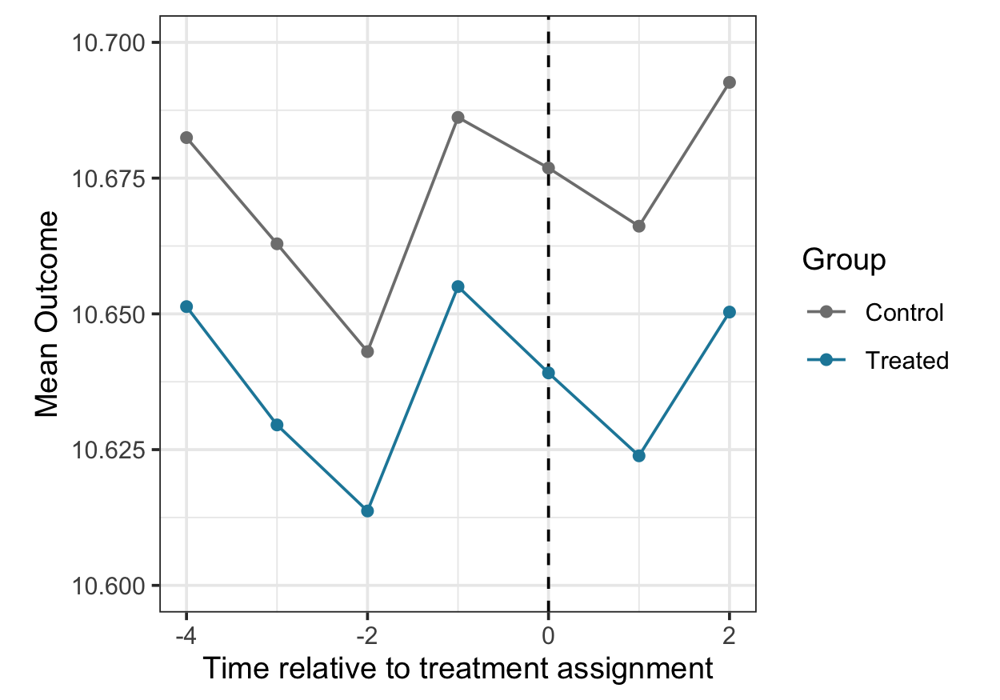

# DIDdesign: Double Difference-in-Differences

<!-- badges: start -->

[](https://github.com/naoki-egami/DIDdesign/actions)
<!-- badges: end -->

Authors:

  - [Naoki Egami](https://naokiegami.com/)
  - [Soichiro Yamauchi](https://soichiroy.github.io/)

Reference:

  - Egami and Yamauchi (2019) “Using Multiple Pre-treatment Periods to
    Improve Difference-in-Differences and Staggered Adoption Designs.”

## Installation Instructions:

  - Downloading the most recent version of `DIDdesign` from Github
    
    ``` r
    ## need to install `devtools` if necessary
    require(devtools)
    install_github("naoki-egami/DIDdesign", dependencies = TRUE)
    ```

## The Standard Difference-in-Differences Design

### Panel Data

``` r
## load package
require(DIDdesign)

## load data
data(anzia2012)
```

``` r
## estimate treatment effect
set.seed(1234)
fit_panel <- did(
  formula  = lnavgsalary_cpi ~ oncycle | teachers_avg_yrs_exper +
                                          ami_pc + asian_pc + black_pc + hisp_pc,
  data     = anzia2012,
  id_unit  = "district",
  id_time  = "year",
  design   = "did",
  is_panel = TRUE,
  option   = list(n_boot = 200, parallel = TRUE, lead = 0:2)
)
```

`did()` function takes the following arguments:

  - `formula`: A formula specifying variables. It should follow the form
    of `outcome ~ treatment | covariates`.
      - `treatment` should be time-varying, that is, `treatment` takes
        zero for everyone before the treatment assignment, and takes 1
        for units who are treated. See the example for how the treatment
        variable should be coded.
      - `covariates` can be omitted as `outcome ~ treatment`.
  - `data`: A data frame. This can be either `data.frame` or `tibble`/
  - `id_unit`: A variable name in the data that uniquely identifies
    units (e.g., individuals or states).
  - `id_time`: A variable name in the data that uniquely identifies time
    (e.g., year).
  - `design`: Design option. It should be `"did"` when the standard DID
    design is used.
  - `is_panel`: A boolean argument to indicate the type of the data.
    When the dataset is panel (i.e., same observations are measured
    repeately overtime), it should take `TRUE`. See the next section for
    how to analyze the repeated cross-section data.
  - `option`: A list of options.
      - `n_boot`: Number of bootstrap iterations to estimate weighting
        matrix.
      - `parallel`: A boolean argument. If `TRUE`, bootstrap is
        conducted in parallel using `future` package.
      - `lead`: A vector of non-negative lead parameter. For example,
        when `lead = c(0, 1)`, treatment effect when the treatment is
        assigned (`lead = 0`) as well as one-time ahead effect (`lead
        = 1`) will be estimated. Default is `lead = 0`.

<!-- end list -->

``` r
## view the estimates
summary(fit_panel)
#> # A tibble: 9 x 7
#>   estimator   lead estimate std.error statistic p_value ddid_weight
#>   <chr>      <int>    <dbl>     <dbl>     <dbl>   <dbl>       <dbl>
#> 1 Double-DID     0 -0.00388   0.00264    -1.47  0.142        NA    
#> 2 DID            0 -0.00620   0.00275    -2.26  0.0241       -0.286
#> 3 sDID           0 -0.00439   0.00435    -1.01  0.312         1.29 
#> 4 Double-DID     1 -0.00735   0.00346    -2.13  0.0336       NA    
#> 5 DID            1 -0.0115    0.00392    -2.94  0.00332       0.504
#> 6 sDID           1 -0.00313   0.00391    -0.800 0.424         0.496
#> 7 Double-DID     2 -0.00648   0.00422    -1.53  0.125        NA    
#> 8 DID            2 -0.0115    0.00505    -2.27  0.0230        0.613
#> 9 sDID           2  0.00145   0.00457     0.318 0.750         0.387
```

`summary()` function can be used to view estimates.

### Repeated Cross-sectional Data

Sometimes, each period consists of different units, instead of repeated
observations of the same units. `did()` can handle such “repeated
cross-sectional” data by setting `is_panel = FALSE`. As an example, we
analyze `malesky2014` dataset (see `?malesky2014` for more details on
this dataset).

``` r
## load data
data(malesky2014)

## estimate ATT
set.seed(1234)
ff_rcs <- did(
  formula = transport ~ treatment + post_treat | factor(city),
  data    = malesky2014,
  id_time = 'year',
  is_panel= FALSE,
  option  = list(n_boot = 20, parallel = FALSE, id_cluster = "tinh", lead = 0)
)
```

  - `formula` now includes `treatment` variable as well as the
    post-treatment time indicator.
  - `id_cluster`: A variable used to cluster the standard errors.

<!-- end list -->

``` r
summary(ff_rcs)
#> # A tibble: 3 x 7
#>   estimator   lead estimate std.error statistic p_value ddid_weight
#>   <chr>      <dbl>    <dbl>     <dbl>     <dbl>   <dbl>       <dbl>
#> 1 Double-DID     0    0.228    0.0773      2.95 0.00320      NA    
#> 2 DID            0    0.101    0.0880      1.14 0.253        -0.871
#> 3 sDID           0    0.169    0.119       1.42 0.156         1.87
```

## Staggered Adoption Design

`DIDdesign` supports the staggered adoption design where units receive
the treatment at different periods of time. As an example, we analyze
`paglayan2019` dataset in the package (see `?paglayan2019` for more
details about this dataset).

``` r
## data
require(dplyr)
require(tibble)

## format dataset
paglayan2019 <- paglayan2019 %>%
    filter(!(state %in% c("WI", "DC"))) %>%
  mutate(id_time = year,
         id_subject = as.numeric(as.factor(state)),
         log_expenditure = log(pupil_expenditure + 1),
         log_salary      = log(teacher_salary + 1))
```


As we can see in the above plot, states receive the treatment at
different years ranging from 1965 at earliest to 1987 at latest (and
some of the states never receive the treatment).

`did()` function can handle the staggered adoption design by setting the
`design` argument to `design = "SA"`.

``` r
## estimate time-weighted SA-ATE
set.seed(1234)
fit_sa <- did(
  formula = log_expenditure ~ treatment,
  data    = paglayan2019,
  id_unit = "id_subject",
  id_time = "id_time",
  design  = "sa",
  option  = list(n_boot = 200, lead = 0:5, thres = 2, parallel = TRUE)
)
```

In addition to options described in the previous section, there is one
additional argument specific to the staggered adoption design.

  - `thres` parameter in the option control the minimum number of
    treated units for a particular time to be included in the treatment
    effect estimation. For example if `thres = 2`, the effect for
    Tennessee will be removed from the time-average effect because it’s
    the only unit who received the treatment in 1972 (i.e., the number
    of treated units in 1972 is less than the threshold).

<!-- end list -->

``` r
summary(fit_sa)
#> # A tibble: 18 x 7
#>    estimator      lead  estimate std.error statistic p_value ddid_weight
#>    <chr>         <int>     <dbl>     <dbl>     <dbl>   <dbl>       <dbl>
#>  1 SA-Double-DID     0  0.00805     0.0235    0.343   0.732      NA     
#>  2 SA-DID            0  0.0149      0.0151    0.991   0.322      -0.164 
#>  3 SA-sDID           0  0.00903     0.0201    0.450   0.653       1.16  
#>  4 SA-Double-DID     1 -0.0165      0.0202   -0.815   0.415      NA     
#>  5 SA-DID            1  0.000916    0.0190    0.0481  0.962       0.166 
#>  6 SA-sDID           1 -0.0199      0.0240   -0.833   0.405       0.834 
#>  7 SA-Double-DID     2  0.0235      0.0112    2.11    0.0352     NA     
#>  8 SA-DID            2  0.0267      0.0160    1.67    0.0953      0.532 
#>  9 SA-sDID           2  0.0199      0.0154    1.29    0.197       0.468 
#> 10 SA-Double-DID     3 -0.00992     0.0224   -0.443   0.657      NA     
#> 11 SA-DID            3  0.0205      0.0140    1.47    0.143       0.0670
#> 12 SA-sDID           3 -0.0121      0.0239   -0.505   0.613       0.933 
#> 13 SA-Double-DID     4 -0.0160      0.0189   -0.849   0.396      NA     
#> 14 SA-DID            4  0.00759     0.0165    0.461   0.645       0.106 
#> 15 SA-sDID           4 -0.0188      0.0210   -0.895   0.371       0.894 
#> 16 SA-Double-DID     5  0.00128     0.0112    0.114   0.909      NA     
#> 17 SA-DID            5  0.00930     0.0143    0.651   0.515       0.407 
#> 18 SA-sDID           5 -0.00421     0.0161   -0.261   0.794       0.593
```


