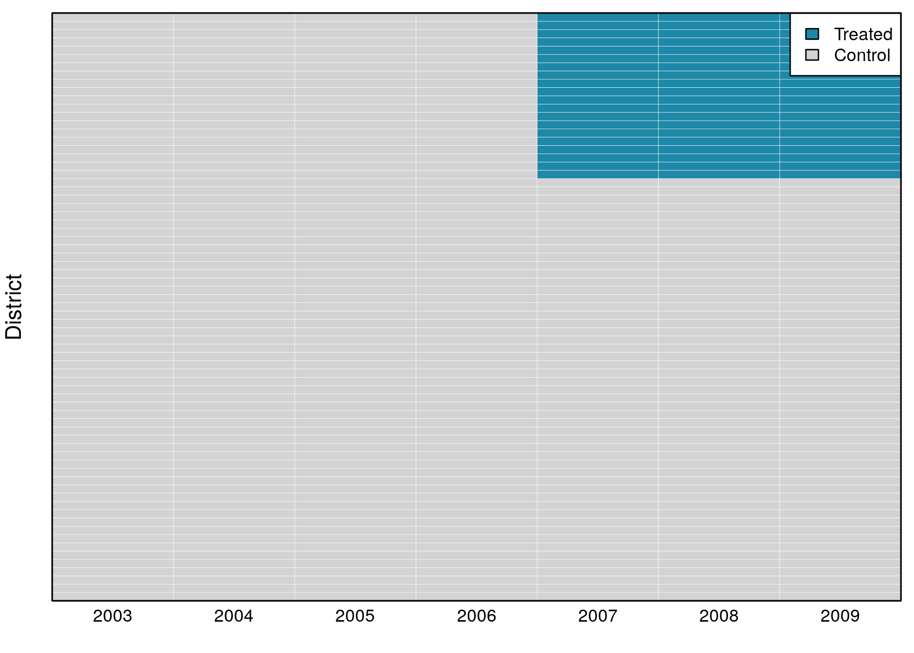
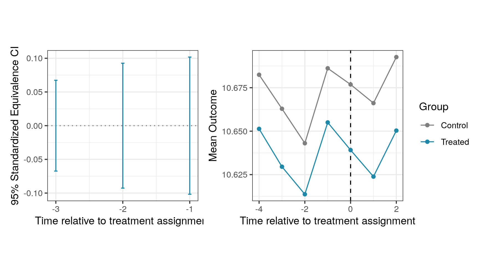
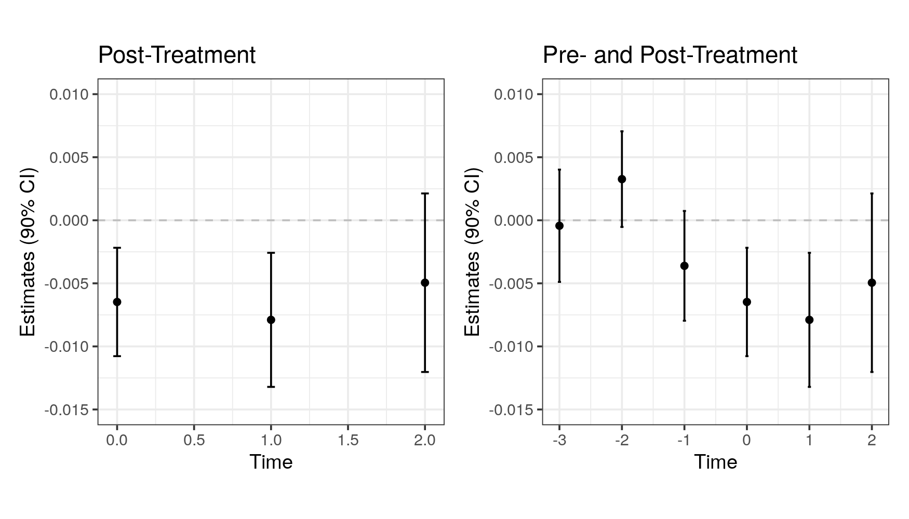
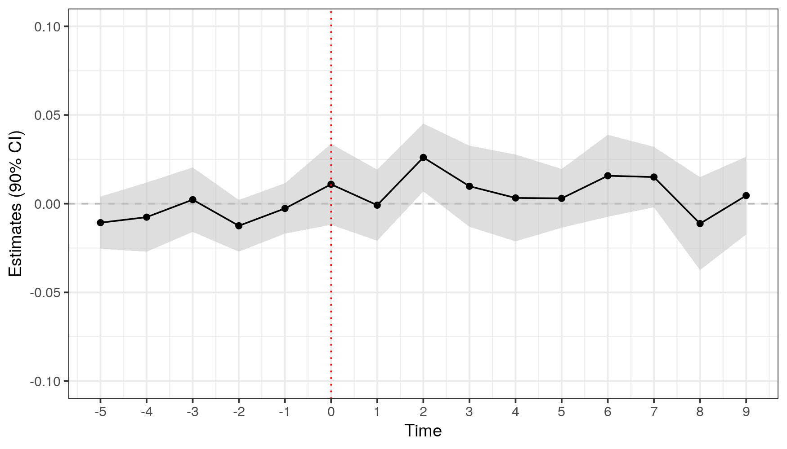

# DIDdesign: Analyzing Difference-in-Differences Design

<!-- badges: start -->

[](https://github.com/naoki-egami/DIDdesign/actions)
<!-- badges: end -->

Authors:

  - [Naoki Egami](https://naokiegami.com/)
  - [Soichiro Yamauchi](https://soichiroy.github.io/)

Reference:

  - Egami and Yamauchi (2019) “[Using Multiple Pre-treatment Periods to
    Improve Difference-in-Differences and Staggered Adoption
    Designs.](https://soichiroy.github.io/files/papers/double_did.pdf)”

## Installation Instructions:

  - Downloading the most recent version of `DIDdesign` from Github
    
    ``` r
    ## need to install `devtools` if necessary
    require(devtools)
    install_github("naoki-egami/DIDdesign", dependencies = TRUE)
    ```

## Table of Contents

1.  [Overview](#Overview-and-Workflow-in-%60DIDdesign%60)
2.  [Basic DID design with panel
    data](#The-Basic-Difference-in-Differences-Design-with-Panel-Data)
3.  [Basic DID design with repeated cross-section
    data](#The-Basic-DID-Design-with-Repeated-Cross-sectional-Data)
4.  [Staggered adoption design](#Staggered-Adoption-Design)

## Overview and Workflow in `DIDdesign`

### Workflow

  - **Step 1**: Assessing the parallel trends assumption via
    `did_check()`
      - View and visualize the output via `plot()` and `summary()`
  - **Step 2**: Estimating the treatment effects via `did()`
      - View and visualize the output via `plot()` and `summary()`

## The Basic Difference-in-Differences Design with Panel Data

``` r
## load package
require(DIDdesign)
require(tidyverse)


## load data
data(anzia2012)
```

In the basic DID design, units receive the treatment at the same time.
In `anzia2012` dataset, the treatment assignment happens in 2007.



### Step 1: Assess the parallel trends assumption

As the first step of the double DID method, users can check if the
parallel trends assumption is plausible in the pre-treatment periods.
`did_check()` function estimates statistics for testing the parallel
trends and computes the equivalence confidence intervals.

``` r
## check parallel trends
set.seed(1234)
check_panel <- did_check(
  formula = lnavgsalary_cpi ~ oncycle | teachers_avg_yrs_exper +
                       ami_pc + asian_pc + black_pc + hisp_pc,
  data    = anzia2012,
  id_unit = "district",
  id_time = "year",
  option  = list(n_boot = 200, parallel = TRUE, lag = 1:3)
)
```

`did_check()` function takes the following arguments:

| Argument   | Description                                                                                                                                                                                                                                                                                                                                                                                                                                                                                                              |
| :--------- | :----------------------------------------------------------------------------------------------------------------------------------------------------------------------------------------------------------------------------------------------------------------------------------------------------------------------------------------------------------------------------------------------------------------------------------------------------------------------------------------------------------------------- |
| `formula`  | A formula specifying variables. It should follow the form of `outcome ~ treatment \| covariates`. <br /> -`treatment` should be time-varying, that is, `treatment` takes zero for everyone before the treatment assignment, and takes 1 for units who are treated. See the example for how the treatment variable should be coded.<br /> -`covariates` can be omitted as `outcome ~ treatment`.                                                                                                                          |
| `data`     | A data frame. This can be either `data.frame` or `tibble`.                                                                                                                                                                                                                                                                                                                                                                                                                                                               |
| `id_unit`  | A variable name in the data that uniquely identifies units (e.g., individuals or states)                                                                                                                                                                                                                                                                                                                                                                                                                                 |
| `id_time`  | A variable name in the data that uniquely identifies time (e.g., year).                                                                                                                                                                                                                                                                                                                                                                                                                                                  |
| `design`   | Design option. It should be `"did"` when the basic DID design is used.                                                                                                                                                                                                                                                                                                                                                                                                                                                   |
| `is_panel` | A boolean argument to indicate the type of the data. When the dataset is panel (i.e., same observations are measured repeatedly overtime), it should take `TRUE`. See the next section for how to analyze the repeated cross-section data.                                                                                                                                                                                                                                                                               |
| `option`   | A list of option parameters. <br /> - `n_boot`: Number of bootstrap iterations to estimate weighting matrix. <br /> - `parallel`: A boolean argument. If `TRUE`, bootstrap is conducted in parallel using `future` package. <br /> - `lag`: A vector of positive lag values. For example, when `lag = c(1, 2)`, pre-treatment trends are tested on the period between `t-2` to `t-1` (corresponding to `lag = 1`), and between `t-3` and `t-2` where `t` is when the actual treatment is assigned. Default is `lag = 1`. |

#### Assessing the output from `did_check()`

The output from `did_check()` function can be accessed by `summary()`
function, which reports estimates for the pre-treatment parallel trends
as well as the 95% standardized equivalence confidence interval.

``` r
## view estimates
summary(check_panel)
#> ── Estimates for assessing parallel trends assumption ──────────────────────────
#>    estimate lag std.error EqCI95_LB EqCI95_UB
#> 1 -0.003613   1   0.00265   -0.1018    0.1018
#> 2  0.003263   2   0.00231   -0.0926    0.0926
#> 3 -0.000434   3   0.00271   -0.0674    0.0674
```

  - `estimate` shows the DID estimates on the pre-treatment periods.
    Deviation from zero suggests the possible violation of the parallel
    trends assumption.
  - `std.error` shows the standard errors for the estimates reported on
    the `estimate` column.
  - `EqCI95_LB` and `EqCI95_UB` show the upper and lower bound on the
    95% standardized equivalence confidence intervals. Values are
    standardized such that they can be interpreted as the standard
    deviation from the mean of the baseline control group. For example,
    `EqCI95_LB` for `lag = 1` can be interpreted as `EqCI95_LB` standard
    deviation away from the mean of the control group at time `t - 2`
    (`lag = 1` corresponds to the parallel trends check between time
    `t-2` and `t-1`). Wider intervals suggests the possible violation of
    the parallel trends assumption.

The output can be also visualized by `plot()` function. By default, it
shows a plot for the 95% standardized equivalence confidence intervals
on the left, and a plot of the observed trends on the right. The
generated plots are in `ggplot` object, thus users can add additional
attributes using functions from `ggplot2`.

``` r
## visualize the estimates
plot(check_panel)
```



  - Data used to generate the above plot are available via
    
    ``` r
    ## data for the trend-plot
    check_panel$plot[[1]]$dat_plot
    
    ## data for the equivalence plot
    check_panel$plot[[2]]$dat_plot
    ```

  - Individual plots are also available via
    
    ``` r
    ## trend plot
    check_panel$plot[[1]]$plot
    
    ## equivalence plot
    check_panel$plot[[2]]$plot
    ```

### Step 2: Estimate the treatment effect with the double DID estimator

After assessing the parallel trends assumption with `did_check()`, we
can estimate the average treatment effect on the treated (ATT) via
`did()`.

``` r
## estimate treatment effect
set.seed(1234)
fit_panel <- did(
  formula  = lnavgsalary_cpi ~ oncycle | teachers_avg_yrs_exper +
                                          ami_pc + asian_pc + black_pc + hisp_pc,
  data     = anzia2012,
  id_unit  = "district",
  id_time  = "year",
  design   = "did",
  is_panel = TRUE,
  option   = list(n_boot = 200, parallel = TRUE, lead = 0:2)
)
```

`did()` function inherits most of the arguments in `did_check()`.
Different from `did_check()`, `did()` takes `lead` parameter in the
option argument.

| Argument | Description                                                                                                                                                                                                                                                                   |
| :------- | :---------------------------------------------------------------------------------------------------------------------------------------------------------------------------------------------------------------------------------------------------------------------------- |
| `lead`   | A parameter in `option` argument. It should be a vector of non-negative lead values. For example, when `lead = c(0, 1)`, treatment effect when the treatment is assigned (`lead = 0`) as well as one-time ahead effect (`lead = 1`) will be estimated. Default is `lead = 0`. |

#### Assessing the output from `did()`

Users can obtain the estimates via `summary()` function.

``` r
## view the estimates
summary(fit_panel)
#> ── ATT Estimates ───────────────────────────────────────────────────────────────
#>    estimator lead estimate std.error statistic p_value
#> 1 Double-DID    0  -0.0041    0.0026      -1.6  0.1149
#> 2        DID    0  -0.0062    0.0027      -2.3  0.0194
#> 3       sDID    0  -0.0044    0.0044      -1.0  0.3179
#> 4 Double-DID    1  -0.0067    0.0032      -2.1  0.0370
#> 5        DID    1  -0.0115    0.0036      -3.2  0.0016
#> 6       sDID    1  -0.0031    0.0039      -0.8  0.4260
#> 7 Double-DID    2  -0.0051    0.0043      -1.2  0.2376
#> 8        DID    2  -0.0115    0.0049      -2.3  0.0196
#> 9       sDID    2   0.0015    0.0049       0.3  0.7664
```

  - `estimator`
      - `Double-DID` shows estimates from the double DID estimator that
        combines the extended parallel trends assumption. This estimate
        should be used only when the parallel trends assumption is
        plausible.
      - `DID` shows estimates from the standard DID estimator.
      - `sDID` shows estimates from the sequential DID estimator that
        requires a weaker parallel trends-in-trends assumption. When the
        parallel trends assumption is not plausible, this estimator
        should be used.

`plot()` function for the output from `did()` can be used in two ways.
First, it generates a treatment effect plot when the function is
provided an output from `did()`. Second, it generates a plot that adds
the pre-treatment trend check in addition to the treatment effect
estimates when the function is provided an output from `did()` as well
as `did_check()`.

``` r
# plot only treatment effects
post_plot <- plot(fit_panel)

# plot treatment effects + pre-treatment assessment
pre_post_plot <- plot(fit_panel, check_fit = check_panel)

## show the plots side-by-side
require(patchwork)
(post_plot +
  ggplot2::theme(aspect.ratio=1) +
  ggplot2::ylim(-0.015, 0.01) +
  ggplot2::labs(title = "Post-Treatment")) +
(pre_post_plot +
  ggplot2::theme(aspect.ratio=1) +
  ggplot2::ylim(-0.015, 0.01) +
  ggplot2::labs(title = "Pre- and Post-Treatment"))
```



## The Basic DID Design with Repeated Cross-sectional Data

Sometimes, each period consists of different units, instead of repeated
observations of the same units. `did()` can handle such “repeated
cross-sectional” data by setting `is_panel = FALSE`. As an example, we
analyze `malesky2014` dataset (see `?malesky2014` for more details on
this dataset).

### Step 1: Assess the pre-treatment parallel trends

``` r
## load data
data(malesky2014)

## check parallel trends
set.seed(1234)
check_rcs <- did_check(
  formula = vpost ~ treatment + post_treat | factor(city),
  data    = malesky2014,
  id_time = "year",
  is_panel= FALSE,
  option  = list(n_boot = 200, parallel = TRUE, id_cluster = "id_district", lag = 1)
)
```

`did_check()` and `did()` for repeated cross-sectional data accept a
slightly different argument from the case of panel data.

| Argument     | Description                                                                                                                                            |
| :----------- | :----------------------------------------------------------------------------------------------------------------------------------------------------- |
| `formula`    | It should include the post-treatment indicator, in addition to the time-invariant `treatment` variable. Covariates are supported as in the panel case. |
| `is_panel`   | It should be `FALSE` to indicate that the data is in the repeated cross-sectional format.                                                              |
| `id_cluster` | A parameter for `option` argument. It should be a variable name used to cluster the standard errors.                                                   |

``` r
## summary
summary(check_rcs)
#> ── Estimates for assessing parallel trends assumption ──────────────────────────
#>   estimate lag std.error EqCI95_LB EqCI95_UB
#> 1  -0.0143   1    0.0406    -0.176     0.176
```

``` r
## view plot
plot(check_rcs)
```


### Step 2: Estimate causal effects

``` r
## estimate ATT
ff_rcs <- did(
  formula = vpost ~ treatment + post_treat | factor(city),
  data    = malesky2014,
  id_time = 'year',
  is_panel= FALSE,
  option  = list(n_boot = 200, parallel = TRUE, id_cluster = "id_district", lead = 0)
)
```

``` r
## view summary
summary(ff_rcs)
#> ── ATT Estimates ───────────────────────────────────────────────────────────────
#>    estimator lead estimate std.error statistic p_value
#> 1 Double-DID    0    0.077     0.050      1.53    0.13
#> 2        DID    0    0.054     0.055      0.98    0.33
#> 3       sDID    0    0.068     0.081      0.85    0.40
```

## The Staggered Adoption Design

`DIDdesign` supports the staggered adoption design where units receive
the treatment at different periods of time. As an example, we analyze
`paglayan2019` dataset in the package (see `?paglayan2019` for more
details about this dataset).

``` r
## data
require(dplyr)
require(tibble)

## format dataset
paglayan2019 <- paglayan2019 %>%
  filter(!(state %in% c("WI", "DC"))) %>%
  mutate(id_time = year,
         id_subject = as.numeric(as.factor(state)),
         log_expenditure = log(pupil_expenditure + 1),
         log_salary      = log(teacher_salary + 1))
```


As we can see in the above plot, states receive the treatment at
different years ranging from 1965 at earliest to 1987 at latest (and
some of the states never receive the treatment).

### Step 1: Assess the pre-treatment parallel trends

``` r
set.seed(1234)
check_sa <- did_check(
  formula = log_expenditure ~ treatment,
  data    = paglayan2019,
  id_unit = "id_subject",
  id_time = "id_time",
  design  = "sa",
  option  = list(n_boot = 200, parallel = TRUE, thres = 1, lag = 1:5)
)
```

Most of the arguments are common to the case of the basic DID design.
There are a few additional arguments specific to the staggered adoption
design.

| Argument | Description                                                                                                                                                                                                                                                                                                                                                                                            |
| :------- | :----------------------------------------------------------------------------------------------------------------------------------------------------------------------------------------------------------------------------------------------------------------------------------------------------------------------------------------------------------------------------------------------------- |
| `design` | A design argument. It should take `design = "sa"` for the staggered adoption design                                                                                                                                                                                                                                                                                                                    |
| `thres`  | A parameter in the `option` argument. It controls the minimum number of treated units for a particular time to be included in the treatment effect estimation. For example if `thres = 2`, the effect for Tennessee will be removed from the time-average effect because it’s the only unit who received the treatment in 1972 (i.e., the number of treated units in 1972 is less than the threshold). |

``` r
## view estimates
summary(check_sa)
#> ── Estimates for assessing parallel trends assumption ──────────────────────────
#>   estimate lag std.error EqCI95_LB EqCI95_UB
#> 1 -0.00267   1   0.00864    -0.109     0.109
#> 2 -0.01245   2   0.00886    -0.162     0.162
#> 3  0.00227   3   0.01105    -0.123     0.123
#> 4 -0.00758   4   0.01185    -0.156     0.156
#> 5 -0.01070   5   0.00894    -0.124     0.124
```

`plot()` function behaves slight differently from the basic DID design.
By default, it plots the treatment variation plot on the right.

``` r
plot(check_sa)
```


### Step 2: Estimate staggered-adoption average treatment effect

`did()` function can handle the staggered adoption design by setting the
`design` argument to `design = "sa"`.

``` r
## estimate time-weighted SA-ATE
set.seed(1234)
fit_sa <- did(
  formula = log_expenditure ~ treatment,
  data    = paglayan2019,
  id_unit = "id_subject",
  id_time = "id_time",
  design  = "sa",
  option  = list(n_boot = 200, parallel = TRUE, thres = 1, lead = 0:9)
)
```

``` r
head(summary(fit_sa))
#> ── ATT Estimates ───────────────────────────────────────────────────────────────
#>       estimator lead estimate std.error statistic p_value
#> 1 SA-Double-DID    0   0.0137     0.017     0.823    0.41
#> 2        SA-DID    0   0.0110     0.014     0.792    0.43
#> 3       SA-sDID    0   0.0137     0.016     0.832    0.41
#> 4 SA-Double-DID    1  -0.0053     0.014    -0.387    0.70
#> 5        SA-DID    1   0.0011     0.013     0.084    0.93
#> 6       SA-sDID    1  -0.0072     0.017    -0.414    0.68
```

``` r
## plot treatment effects + assessment statistic
sa_plot <- plot(fit_sa, check_sa, band = TRUE)

## show plot
sa_plot +
  ggplot2::ylim(-0.1, 0.1) +
  ggplot2::geom_vline(xintercept = 0, color = 'red', linetype = 'dotted')
```


